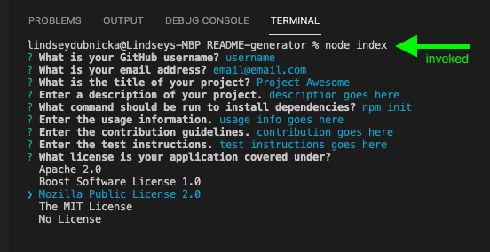
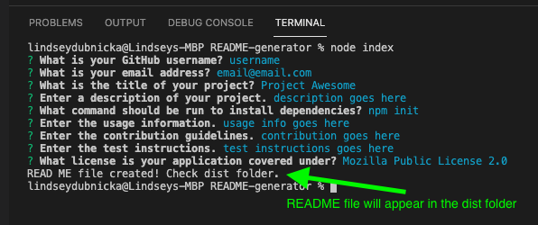

# Professional README Generator

## Description
When creating an open source project on GitHub, it is important to have a high-quality README for the app. This application can quickly and easily generate a README file by using a command line application. 
  
## Installation
To install necessary dependencies, run the following command: 
```
npm install
```

## Usage
The application will be invoked from the command line by entering: `node index` <br />
The screen shots below will give you an idea of how this application should work, or checkout the video link below to get a step-by-step demo. 
https://drive.google.com/file/d/16ZmFqoNxq0SttKIZCIOSxVEwbrgAiOv9/view

 <br />


## Questions
Feel free to reach out to me for any questions or comments. <br/>
Link to my GitHub: github.com/lindseymiller2567